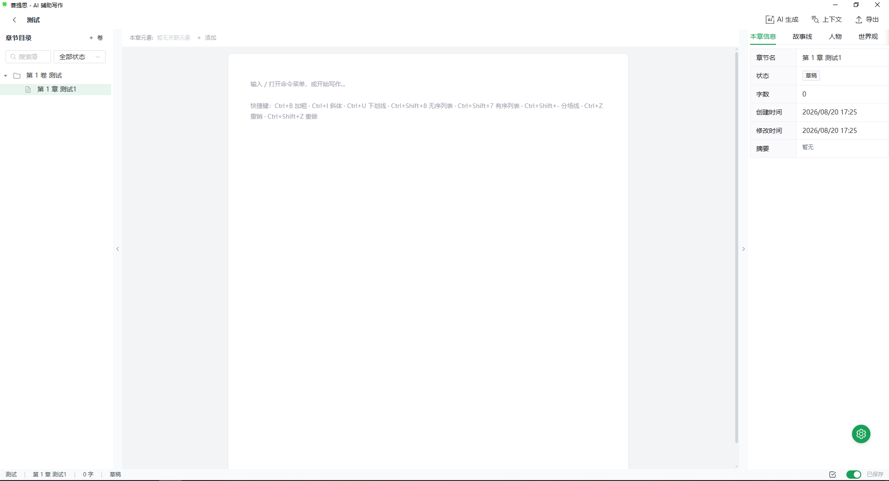

# 菩提思

AI 小说编辑器 — 基于 Rust + Tauri + Vue3 构建的桌面应用。为长篇小说创作而生：RAG 检索增强、本地嵌入模型、章节摘要与长上下文管理、伏笔与灵感管理，让 AI 真正读懂你的故事。

## 核心亮点

- **AI 懂上下文**：自动注入上一章摘要、相关角色 / 故事线 / 世界观、待埋设与待回收的伏笔，生成内容不再"失忆"
- **检索全离线**：本地嵌入模型 + sqlite-vec 向量检索，正文不上传任何第三方服务
- **纯本地运行**：数据全部存储在本地 SQLite，隐私安全可控

## 界面预览

### 首页 — 项目列表


### 编辑器 — 三栏布局



## 功能特性

### 编辑器

- **三栏布局**：章节树 / 编辑器 / 信息面板，支持拖拽调整宽度
- **TipTap v3 富文本**：标题、粗体、斜体、列表、引用、任务列表、链接、图片、高亮等
- **斜杠菜单**：块级操作（删除、上移、下移、复制）
- **场景分割**：章节内插入场景分隔符，支撑场景级结构化创作
- **自动保存**：编辑后 2 秒自动保存，切换章节前自动 flush
- **字数统计**：实时统计章节字数
- **明暗主题**：跟随系统或手动切换，UnoCSS `class` 策略持久化

### 项目管理

- **多项目工作区**：项目卡片列表视图，题材分类、简介一目了然
- **项目封面**：支持自定义封面图片，自动存储于应用数据目录，移除或更换时自动清理旧文件
- **卷章节结构**：卷 / 章节两级树，右键菜单管理，支持排序
- **导入导出**：支持 TXT / Markdown 两种格式导出

### AI 生成

- **统一生成入口**：所有 AI 操作（续写 / 扩写 / 润色）均通过 `AIGenerationDialog` 发起
- **真流式输出**：首 token 即时显示，避免长时间卡顿
- **推理过程展示**：展示模型 thinking 过程，推理完成后自动收起，支持手动展开
- **上下文感知**：
  - 自动注入上一章摘要（缺失时提示用户确认是否继续）
  - 自动排除当前章与上一章避免重复检索
  - 自动注入本章待埋设伏笔与前文待回收伏笔，AI 协助伏笔的埋设与回收
- **生成历史**：按章节记录 AI 生成历史，支持回看与清理

### RAG 检索增强

- **本地嵌入**：使用 `hypembed` 加载 `BAAI/bge-small-zh-v1.5`（512 维），无需联网
- **模型自动下载**：启动时后台从 HuggingFace 拉取缺失模型文件，不阻塞 UI
- **向量检索**：`sqlite-vec` 静态链接扩展，KNN 查询后在 Rust 层过滤
- **并行 RAG**：章节、切片、角色、故事线、世界观检索并行执行
- **检索性能**：RAG 单次查询约 700ms（含 embed + KNN + 回查）

### 长上下文管理

- **章节摘要**：单章生成（已有则提示覆盖）、批量生成（跳过已有摘要的章节）
- **切片嵌入**：章节正文切块后单独嵌入，支持细粒度 RAG 检索
- **嵌入同步**：批量同步项目的摘要与切片嵌入

### 创作元素

- **角色**：名称、描述、角色标签（主角 / 配角等）
- **故事线**：名称、描述、状态标签（进行中 / 已完成 / 已放弃，仅进行中的故事线可在编辑器中关联）
- **世界观**：名称、描述、分类标签（地理 / 势力等）
- **伏笔管理**：独立实体，双章节绑定（埋点章节 / 回收章节）
  - 状态流转：待埋 → 已埋下 → 已回收，可随时废弃
  - AI 生成时自动注入待埋设与待回收伏笔，辅助伏笔收束
- **灵感收集**：随手记录灵感的流式列表（按创建时间倒序），状态标记：待处理 / 已采用 / 已搁置
- **章节关联**：章节可关联多个元素（角色 / 故事线 / 世界观），供编辑与检索引用

### 任务中心

- **异步任务**：批量摘要、嵌入同步等耗时操作通过任务中心后台执行
- **进度追踪**：实时显示任务进度，终态保护防止状态覆盖
- **失败可查**：失败原因记录在任务详情

### AI 配置

- **多 Provider 支持**：OpenAI 兼容接口，内置 DeepSeek 等预设，填 Key 即用
- **API Key 加密**：本地 AES-GCM 加密存储
- **叙事规则模板**：内置宽松 / 严格两套叙事规则提示词模板，可自定义编辑、一键恢复内置默认
- **Provider 切换**：设置默认 Provider 与 API Key

## 技术栈

| 层 | 技术 |
|---|---|
| 后端 | Rust, Tauri v2, SQLx, SQLite, sqlite-vec, Tokio |
| 前端 | Vue3, TypeScript, Pinia, Vue Router |
| UI | Naive UI, UnoCSS (`presetIcons` + Carbon Icons) |
| 编辑器 | TipTap v3 (ProseMirror) |
| AI | reqwest (rustls), SSE 流式解析 |
| 嵌入 | hypembed, BAAI/bge-small-zh-v1.5 |

## 环境要求

- **Rust**: 1.70+（推荐最新稳定版）
- **Node.js**: 18+
- **Yarn**: 1.22+
- **系统依赖**: [Tauri 系统依赖](https://v2.tauri.app/start/prerequisites/)

## 快速开始

### 1. 安装依赖

```bash
yarn install
```

### 2. 开发模式

```bash
yarn tauri dev
```

首次启动会自动下载 `bge-small-zh-v1.5` 嵌入模型（约 100MB）到 `app_data_dir/embedder_model`，完成后 RAG 检索可用。前端支持 HMR 热更新。

### 3. 构建生产版本

```bash
yarn tauri build
```

构建产物位于 `src-tauri/target/release/bundle/`：

- Windows: `.msi` / `.nsis` 安装包 + `.exe` 便携版
- macOS: `.dmg` + `.app`
- Linux: `.deb` / `.AppImage`

### 4. 仅构建前端

```bash
yarn build
```

## 项目结构

```
linden-novel/
├── src/                          # 前端源码
│   ├── api/                      # Tauri IPC 调用封装
│   ├── components/
│   │   ├── ai/                   # AI 生成对话框（AIGenerationDialog）、AI 设置
│   │   ├── common/               # 通用组件（项目卡片、任务中心、设置菜单等）
│   │   ├── editor/               # 编辑器组件（LindenEditor、BlockMenu、场景分割）
│   │   ├── elements/             # 创作元素面板（角色 / 故事线 / 世界观 / 伏笔 / 灵感）
│   │   └── layout/               # 布局组件（三栏、章节树、侧栏、状态栏）
│   ├── composables/              # 组合式函数
│   │   ├── useLongContext.ts     # 摘要 / 批量摘要
│   │   ├── useTaskCenter.ts      # 异步任务
│   │   ├── useTheme.ts           # 主题
│   │   ├── useWordCount.ts       # 字数统计
│   │   └── ...
│   ├── stores/                   # Pinia 状态管理
│   ├── types/                    # TypeScript 类型定义
│   ├── utils/                    # 工具函数（错误处理、时间格式化、封面路径）
│   ├── views/                    # 页面视图（ProjectListView, EditorView）
│   ├── App.vue
│   └── main.ts
├── src-tauri/                    # 后端源码
│   ├── capabilities/             # Tauri 权限配置
│   ├── migrations/               # 数据库迁移脚本（0001–0010）
│   ├── src/
│   │   ├── ai/                   # AI 核心
│   │   │   ├── provider.rs       # Provider trait
│   │   │   ├── openai_provider.rs# OpenAI 兼容实现（流式 + 推理）
│   │   │   ├── local_provider.rs # 本地嵌入 Provider
│   │   │   ├── rag.rs            # RAG 检索（并行）
│   │   │   ├── context_collector.rs # 上下文组装（含伏笔注入）
│   │   │   ├── chunker.rs        # 正文切块
│   │   │   ├── model_downloader.rs # 嵌入模型下载
│   │   │   └── sse.rs            # SSE 流式解析
│   │   ├── commands/             # Tauri 命令（IPC 入口）
│   │   ├── db/                   # 数据库连接池 + Repo 层
│   │   ├── models/               # 数据模型
│   │   ├── services/             # 业务逻辑层
│   │   │   ├── ai_generation_service.rs # AI 生成
│   │   │   ├── summary_service.rs       # 摘要生成
│   │   │   ├── embedding_service.rs     # 嵌入管理
│   │   │   ├── chunk_embedding_service.rs # 切片嵌入
│   │   │   ├── task_manager.rs           # 异步任务
│   │   │   └── ...
│   │   ├── error.rs              # 统一错误类型
│   │   └── lib.rs                # 应用入口
│   ├── Cargo.toml
│   └── tauri.conf.json
```

## 开发指南

### 添加新的 Tauri 命令

1. 在 `src-tauri/src/commands/` 下创建模块
2. 在 `commands/mod.rs` 中导出
3. 在 `lib.rs` 的 `invoke_handler` 中注册
4. 在 `src/api/` 下创建对应的 TypeScript 封装
5. 在 `src/types/` 下同步 Rust 模型对应的 TypeScript 类型

### 数据库迁移

在 `src-tauri/migrations/` 下添加新的 SQL 文件，命名格式：`NNNN_description.sql`。SQLx 在启动时自动执行未应用的迁移。

### 配置项

通过环境变量配置：

| 变量 | 默认 | 说明 |
|---|---|---|
| `LINDEN_EMBED_DIM` | `512` | 嵌入向量维度（需与模型一致） |
| `LINDEN_EMBEDDER_DIR` | `app_data_dir/embedder_model` | 嵌入模型存储目录 |

### 性能调优

- dev build 下依赖库（含 hypembed）以 `opt-level=3` 编译，避免推理慢 100–1000 倍
- RAG 检索共享一次 query embedding，章节 / 切片 / 实体检索并行执行
- sqlite-vec 静态链接，无需外部 `.dll`

## 自动更新

应用集成 [tauri-plugin-updater](https://v2.tauri.app/plugin/updater/)，通过 GitHub Releases 托管 + Ed25519 签名校验实现一键自动更新。

### 用户视角

- 发现新版自动弹窗显示版本号与 release notes，点击「立即下载安装」即可一键更新
- 下载完成提示重启，重启后进入新版本
- 浮动设置菜单可随时手动触发「检查更新」

### 首次配置（开发者）

1. 本地生成 Ed25519 签名密钥：

   ```bash
   yarn tauri signer generate -w "<PASSWORD>"
   # 输出：
   # Private key: <BASE64>
   # Public key:  <BASE64>
   ```

2. 在 GitHub 仓库 Settings → Secrets and variables → Actions 添加：
   - `TAURI_SIGNING_PRIVATE_KEY`：上一步输出的私钥 base64
   - `TAURI_SIGNING_PRIVATE_KEY_PASSWORD`：上一步设置的密码

3. 把公钥 base64 填入 [`src-tauri/tauri.conf.json`](file:///d:/file/workspace-rust/linden-novel/src-tauri/tauri.conf.json) 的 `plugins.updater.pubkey` 字段

4. 把 `plugins.updater.endpoints` 中的 `YOUR_GITHUB_OWNER/YOUR_GITHUB_REPO` 替换为实际仓库路径

### 发布流程

1. 同步修改三处 version：[`package.json`](file:///d:/file/workspace-rust/linden-novel/package.json)、[`src-tauri/Cargo.toml`](file:///d:/file/workspace-rust/linden-novel/src-tauri/Cargo.toml)、[`src-tauri/tauri.conf.json`](file:///d:/file/workspace-rust/linden-novel/src-tauri/tauri.conf.json)
2. `git commit -m "release: vX.Y.Z"` → `git tag vX.Y.Z` → `git push origin vX.Y.Z`
3. GitHub Actions 自动跨平台构建（Windows/macOS/Linux）、用私钥签名安装包、生成 `latest.json` 并上传到 Release draft
4. 检查 Release draft 中包含安装包与 `latest.json`（`signature` 字段非空）后 publish
5. 装有旧版本的用户应用启动 5s 内会自动收到更新提示

## 许可证

MIT
